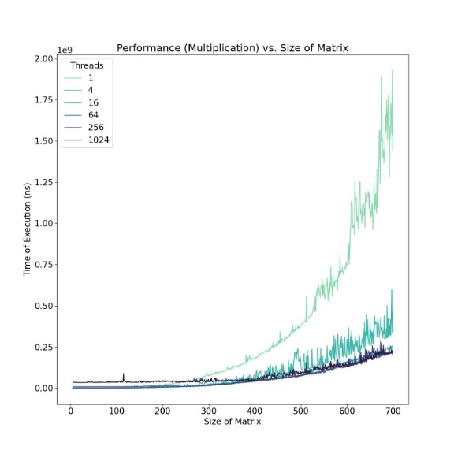
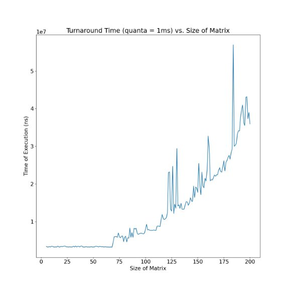
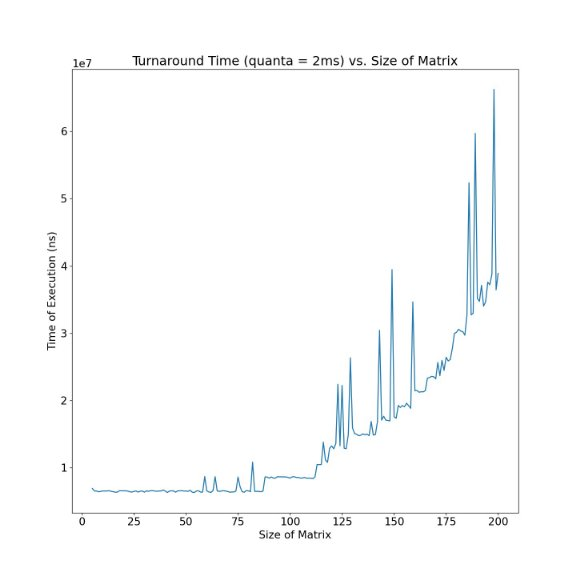
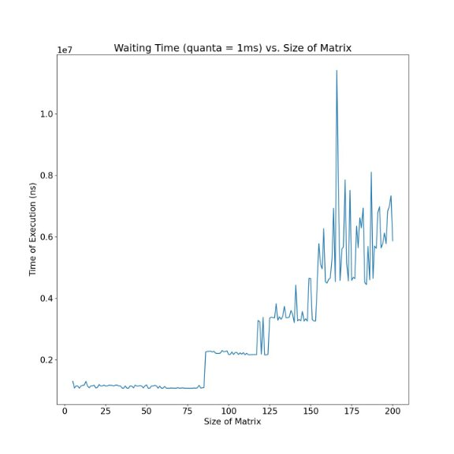
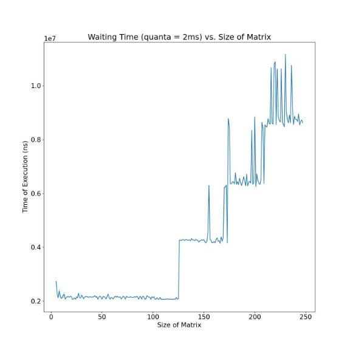

# Matrix Multiplication with Multi-threading

## Contents

1. Introduction

2. Reading matrix with multi-threading

   2.1 Handling Shared Memory

3. Multiplication with multi-threading

4. Scheduling

5. Results

    5.1 Reading
  
    5.2 Multiplication
  
    5.3 Turnaround Time
  
    5.4 Waiting Time

6. References

## 1  Introduction

Matrix multiplication is a requirement in many practical applications today. Opti- mising the speed of multiplication of arbitrarily large matrices is crucial for solving many real-life problems, such as those of AC networks in electronics and also weather forecasting.

It can be observed that the reading of rows and columns and the multiplication of said rows and columns can be done in parallel.

In this project, we aim to study the performance of a round-robin scheduler with different time quanta.

## 2  Reading matrix with multi-threading

Depending on the dimension of the given matrix, each thread is assigned a particular number of rows and columns it has to read. The workload of reading the rows is divided equally among the threads available.

  ### 2.1 Handling Shared Memory

We have allocated 8,000,000 bytes for each matrix and 4,000 bytes each for the read status of rows and columns, hence allowing the process to seamlessly read and multiply two 1000 × 1000 matrices of type long long int.

## 3  Multiplication with multi-threading

The following approach is taken in order to avoid race conditions:

- In the multi-threading function, each row and its corresponding column are put in a spin-lock.
- Before P1() starts its execution, the read status of all the rows and columns is initialized to 0 (indicating that none of the rows or columns has been read).
- So until both the rows and columns are fully read, the multi-threading function is held in a spin-lock, and the moment the read status of both the desired row and columns are set to 1, the multiplication takes place.
- For multiplication, each element of the resultant matrix is assigned an individual thread. If the resultant matrix has a thread equal to the number of elements, then each element gets one thread for its multiplication.

## 4  Scheduling

The Round Robin Scheduler alternates (in a fixed quantum of time 1ms or 2ms) between processes P and P . Two different system calls are used to achieve this are:

- kill() :
  - Used to send a CONTINUE signal to the process (for example, the sched- uler tells P1() to resume its executions).
  - Used to send a STOP signal to the process (for example, the scheduler tells P () to pause its execution after a fixed quantum of time).
  - Identifies the process and sends the appropriate signal based on the pid parameter passed as the first argument.
- usleep() :
  - Used to suspend (put to sleep) the round-robin scheduler of the amount of this passed as the parameter (in µs). So after the kill() system call resumes the   execution of process P , the Round Robin Scheduler is suspended for the specified quantum of time. Allowing process P1() to execute for the specified quanta.

Before scheduling a particular process, the scheduler checks if the process is completed by checking its corresponding flag value. If both the processes are done with their execution, i.e. the scheduler stops its execution (flag variables of both P1 and P2 are set to one).

## 5  Results

### 1. Reading

From Figure [1 ](#_page4_x81.64_y99.13)we can observe that as the number of threads increases, we can observe a greater variation in reading performance, indicating that parallelization does not improve reading times; this can be explained by the fact that the overhead of creating threads and maintaining multiple file pointers and performing the required context switches is greater than the time saved by multi-threading.

Figure 1: Performance for reading matrices

### 2. Multiplication

From figure [2 ](#_page5_x81.64_y206.07)we can conclude that:

- A single thread performs better for small matrix sizes, up to 200 × 200 ma- trices, implying that the overhead of creating new threads is higher than the performance boost due to parallelization at these sizes.
- However, at larger sizes ( > (600 × 600)) the processes with the higher number of threads perform significantly better, agreeing with our hypothesis.
- It should be noted that the process with 1024 threads performs poorly compared

to those with lesser threads; for matrices larger than (700 × 700), the 1024 threads start to show better performance.

Figure 2: Performance of multiplication

### 3. Turnaround Time

From figures [3 ](#_page7_x81.64_y99.13)and [4 ](#_page8_x81.64_y99.13)it can be observed that:

- As matrix size increases, turnaround times for both scheduling schemes (with q = 1ms and 2ms) increase following the same pattern. This is due to the increased number of context switches and computations that have to be done for multiplication.
- Note: The seemingly random peaks in the graph are due to the processor of our personal computers carrying out other tasks in the background.

Figure 3: Turnaround time with quanta = 1ms

Figure 4: Turnaround time with time quanta = 2ms

### 4. Waiting Time

From figures [5 ](#_page9_x81.64_y152.77)and [6 ](#_page10_x81.64_y99.13)we can observe that:

- With increasing size of matrix, the waiting period for each process increases with periodic jumps, depending on the number of time quanta that it has to wait.
- For q = 2ms, the jumps are larger than that for q = 1ms since the each waiting time is twice as long.

Figure 5: Waiting time with quanta = 1ms

Figure 6: Waiting time with quanta = 2ms

## References

[1] All the code in this report has been programmed by us, and can be found in this [GitHub Repository.](https://github.com/legendsovermyths/Multithreaded-Multiplication-Scheduler)
